# Server Setup for Pipeline

## Jenkins
```
sudo apt install openjdk-17-jdk -y

sudo wget -O /usr/share/keyrings/jenkins-keyring.asc \
  https://pkg.jenkins.io/debian-stable/jenkins.io-2023.key
echo deb [signed-by=/usr/share/keyrings/jenkins-keyring.asc] \
  https://pkg.jenkins.io/debian-stable binary/ | sudo tee \
  /etc/apt/sources.list.d/jenkins.list > /dev/null
sudo apt-get update -y
sudo apt-get install jenkins -y

sudo systemctl enable jenkins
sudo systemctl restart jenkins

# Access on default port 8080

# To get Password
sudo cat /var/lib/jenkins/secrets/initialAdminPassword
```
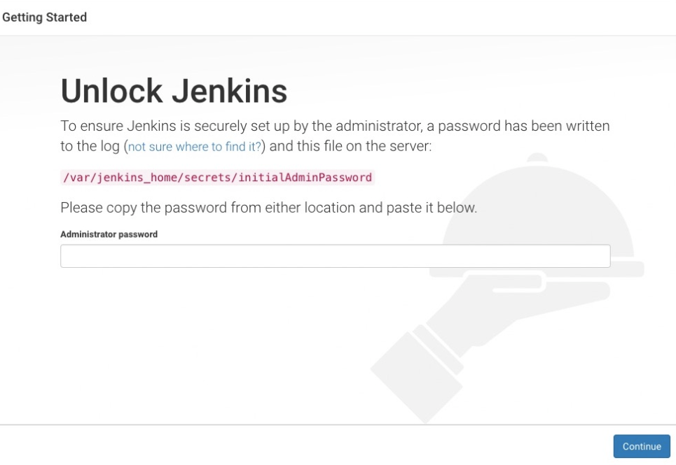

## GitHUb Integration with Jenkins using Webhook

### 1. Configure GitHub Webhook:
Generate a GitHub Personal Access Token:

Go to your GitHub account.
Navigate to "Settings" > "Developer settings" > "Personal access tokens."
Generate a new token with the required permissions (at least repo and admin:repo_hook).

### 2. Configure Webhook in GitHub:

In your GitHub repository, go to "Settings" > "Webhooks" > "Add webhook."
Set the Payload URL to your Jenkins server's webhook endpoint (http://your-jenkins-server:port/github-webhook/).
Set the Content type to application/json.
Choose the events that should trigger the webhook (e.g., push events).
Optionally, configure other settings based on your requirements.

### 3. Add GitHub Personal Access Token in Jenkins Credential:

In Jenkins, navigate to "Manage Jenkins" > "Manage Credentials."
Under the "System" tab, click on "Global credentials."
Add a new "Secret text" credential containing the GitHub Personal Access Token.
Update Jenkins Job Configuration:

**Go back to your Jenkins job configuration.**
In the "Build Triggers" section, choose "GitHub hook trigger for GITScm polling."
In the "Build" section, configure the build steps, as needed.


## Sonarqube
```
docker run -d --name sonar -p 9000:9000 sonarqube:lts-community
```
Access the app on port 9000. `admin' is its username and password by default

### SonarQube integration with Jenkins 

**Step 1. Generate a Token on SonarQube Server:**
- -> Open SonarQube server -> Go to Administration
- -> Click on Security
- -> Users
- -> Click on Tokens
- -> Generate token with some name
- -> Copy the token. It will be used in Jenkins for Sonar authentication.

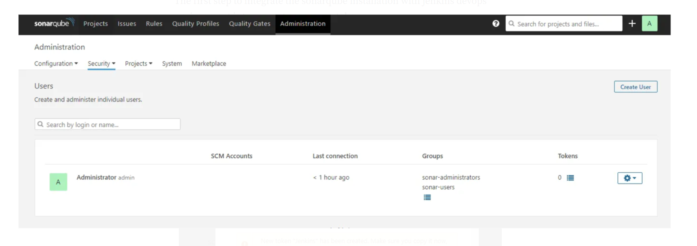
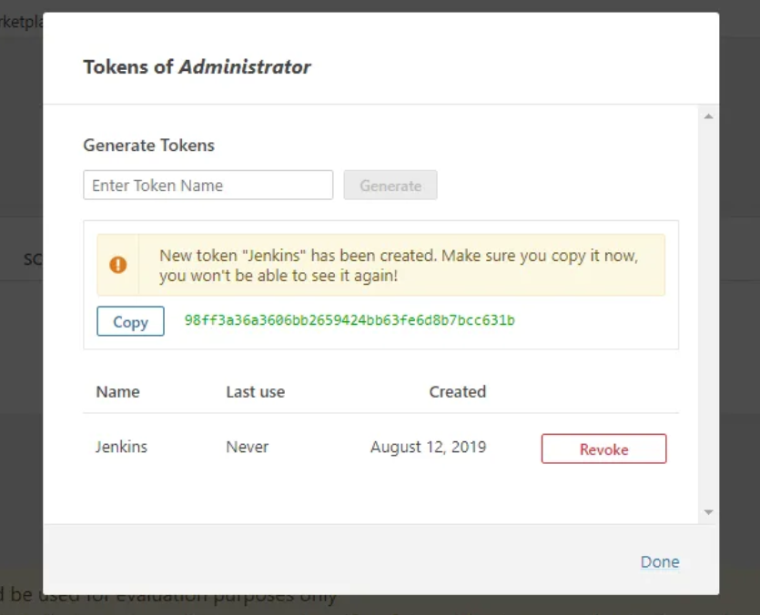

**Step 2. Setup SonarQube in Jenkin Server:**

First install *SonarQube Scanner Plugin*: Dashboard -> Manage Jenkins -> Plugins -> Available Plugins -> Search

**System**
- -> Go to Manage Jenkins -> System -> Scroll down to SonarQube server Section 
- -> Name: *sonar-server*
- -> Server URL: *http://192.168.1.0:9000*          # Replace URL
- -> Server authentication token: *sonar-token*     # Make sure you have added sonarqube token to jenkins credentials 
- -> Apply and Save

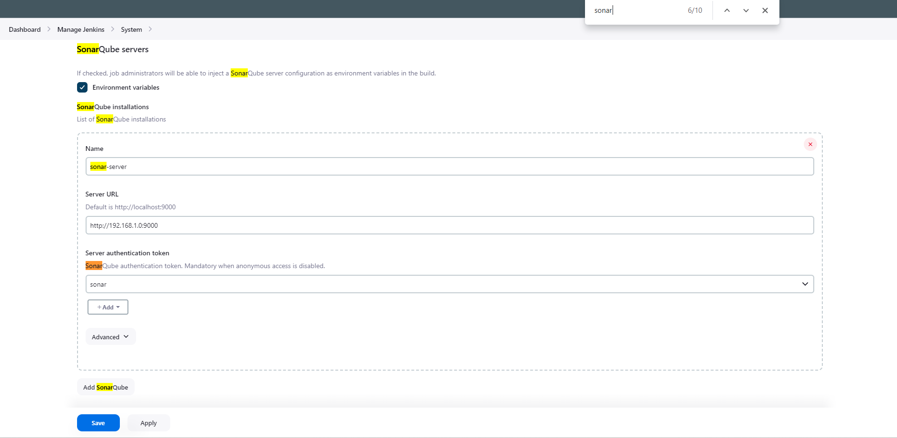
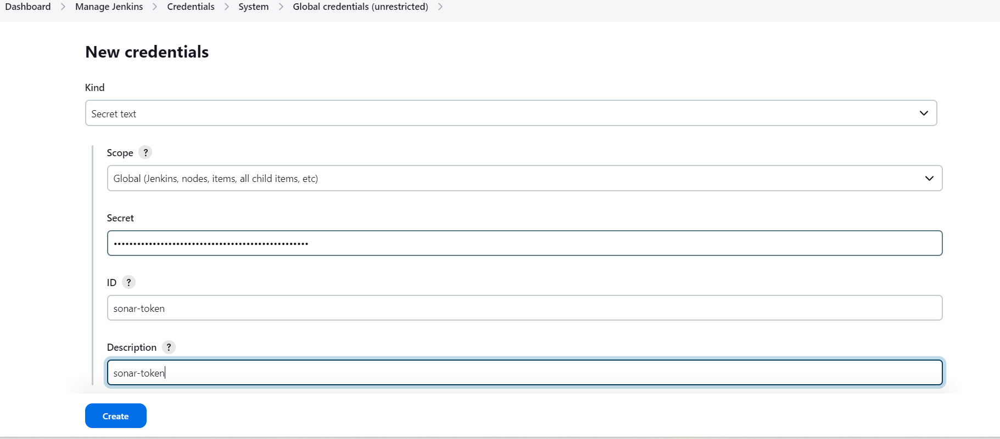

**Tools**
- -> Go to Manage Jenkins -> Tools -> Scroll down to SonarQube server Installation -> Add Sonarqube Server
- -> Name: *sonar-scanner*
- -> Check the box to install automatically -> Select the version you need (optional)
- -> Apply and Save
  
 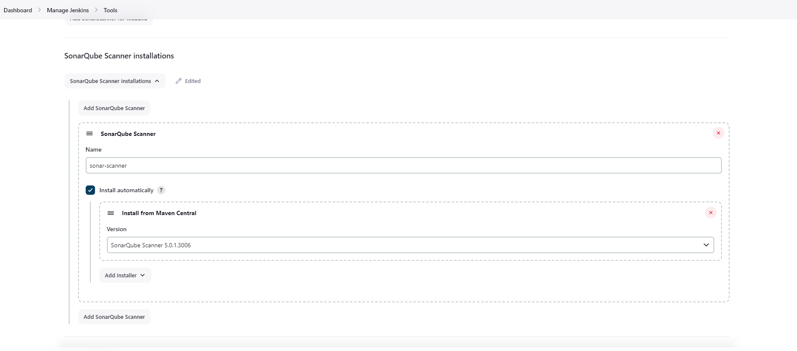 

 ## OWASP Dependency-Check
Dashboard -> Manage Jenkins -> Plugins -> Available Plugins -> Search `Dependency-Check` and install.
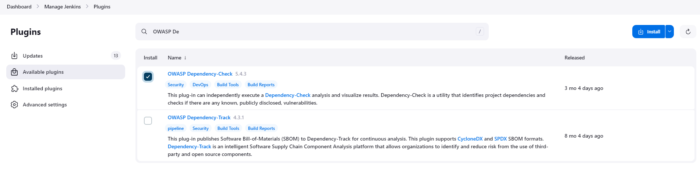 

Once installed, Go to Manage Jenkins -> Tools -> Scroll down to Dependency-Check -> Add `Dependency-Check`
- -> Name: *DP-Check*
- -> Check the box to install automatically
- -> Add Installer: *Install from github.com*

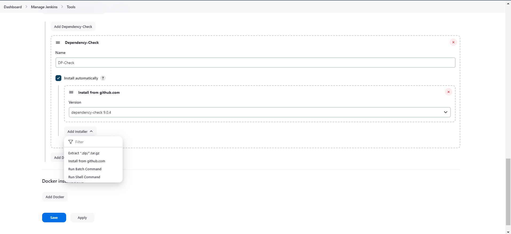


## Install Trivy to scan the File System and Docker Images to detect vulnerabilities
```
sudo apt-get install wget apt-transport-https gnupg lsb-release -y
wget -qO - https://aquasecurity.github.io/trivy-repo/deb/public.key | gpg --dearmor | sudo tee /usr/share/keyrings/trivy.gpg > /dev/null

echo "deb [signed-by=/usr/share/keyrings/trivy.gpg] https://aquasecurity.github.io/trivy-repo/deb $(lsb_release -sc) main" | sudo tee -a /etc/apt/sources.list.d/trivy.list

sudo apt-get update -y
sudo apt-get install trivy -y
```

### Docker
```
sudo apt-get update
sudo apt-get install docker.io -y
sudo usermod -aG docker $USER 
newgrp docker
sudo chmod 777 /var/run/docker.sock
```
  **Jenkins Plugins for Docker**
- Docker
- Docker API
- Docker Pipeline
- Docker Commons Plugin
- docker-build steps

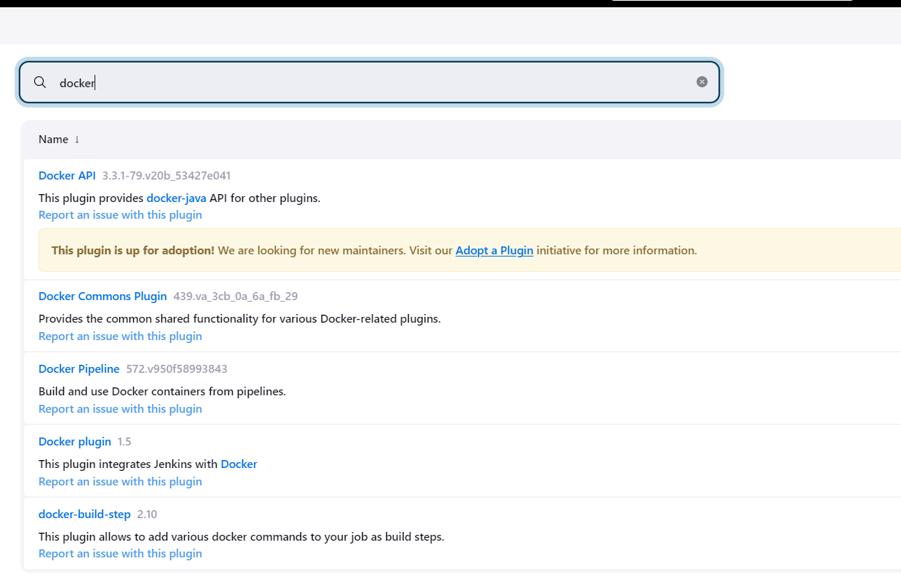


**Add DockerHub Credentials:**
To push the Docker Images to Dockerhub, you will be authenticated. To achieve so, add the Personal Access Token (PAT) of your Dockerhub Acount into Jenkins Credentials
- **Generate Dockerhub PAT:** Go to Dockerhub -> Sign In/Sign Up -> My Account -> Security -> New Access Token

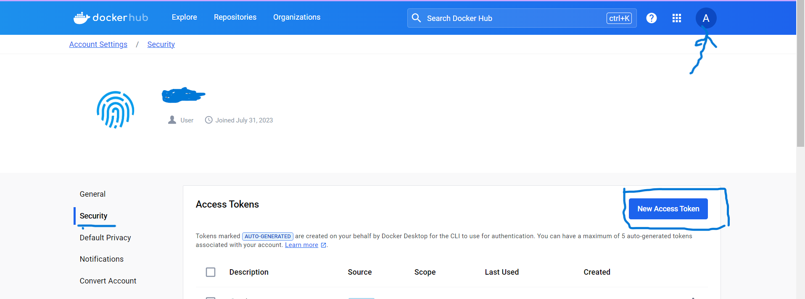

- **Jenkins Server:** Dashboard -> Manage Jenkins -> Credetials -> System -> Global Credentials(unrestricted)
   - ***Kind***: Username and Password
   - ***Scope***: Global
   - ***Username***: <your-dockerhub-account>
   - ***Password***: Paste the Copied PAT
   - ***ID***: dockerhub-passwd
   - ***Description***: dockerhub-passwd(optional)

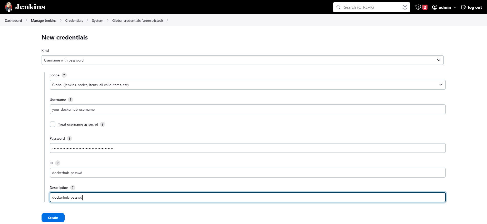


**Phase 4: Monitoring**

1. **Install Prometheus and Grafana:**

   Set up Prometheus and Grafana to monitor your application.

   **Installing Prometheus:**

   First, create a dedicated Linux user for Prometheus and download Prometheus:

   ```bash
   sudo useradd --system --no-create-home --shell /bin/false prometheus
   wget https://github.com/prometheus/prometheus/releases/download/v2.47.1/prometheus-2.47.1.linux-amd64.tar.gz
   ```

   Extract Prometheus files, move them, and create directories:

   ```bash
   tar -xvf prometheus-2.47.1.linux-amd64.tar.gz
   cd prometheus-2.47.1.linux-amd64/
   sudo mkdir -p /data /etc/prometheus
   sudo mv prometheus promtool /usr/local/bin/
   sudo mv consoles/ console_libraries/ /etc/prometheus/
   sudo mv prometheus.yml /etc/prometheus/prometheus.yml
   ```

   Set ownership for directories:

   ```bash
   sudo chown -R prometheus:prometheus /etc/prometheus/ /data/
   ```

   Create a systemd unit configuration file for Prometheus:

   ```bash
   sudo nano /etc/systemd/system/prometheus.service
   ```

   Add the following content to the `prometheus.service` file:

   ```plaintext
   [Unit]
   Description=Prometheus
   Wants=network-online.target
   After=network-online.target

   StartLimitIntervalSec=500
   StartLimitBurst=5

   [Service]
   User=prometheus
   Group=prometheus
   Type=simple
   Restart=on-failure
   RestartSec=5s
   ExecStart=/usr/local/bin/prometheus \
     --config.file=/etc/prometheus/prometheus.yml \
     --storage.tsdb.path=/data \
     --web.console.templates=/etc/prometheus/consoles \
     --web.console.libraries=/etc/prometheus/console_libraries \
     --web.listen-address=0.0.0.0:9090 \
     --web.enable-lifecycle

   [Install]
   WantedBy=multi-user.target
   ```

   Here's a brief explanation of the key parts in this `prometheus.service` file:

   - `User` and `Group` specify the Linux user and group under which Prometheus will run.

   - `ExecStart` is where you specify the Prometheus binary path, the location of the configuration file (`prometheus.yml`), the storage directory, and other settings.

   - `web.listen-address` configures Prometheus to listen on all network interfaces on port 9090.

   - `web.enable-lifecycle` allows for management of Prometheus through API calls.

   Enable and start Prometheus:

   ```bash
   sudo systemctl enable prometheus
   sudo systemctl start prometheus
   ```

   Verify Prometheus's status:

   ```bash
   sudo systemctl status prometheus
   ```

   You can access Prometheus in a web browser using your server's IP and port 9090:

   `http://<your-server-ip>:9090`

   **Installing Node Exporter:**

   Create a system user for Node Exporter and download Node Exporter:

   ```bash
   sudo useradd --system --no-create-home --shell /bin/false node_exporter
   wget https://github.com/prometheus/node_exporter/releases/download/v1.6.1/node_exporter-1.6.1.linux-amd64.tar.gz
   ```

   Extract Node Exporter files, move the binary, and clean up:

   ```bash
   tar -xvf node_exporter-1.6.1.linux-amd64.tar.gz
   sudo mv node_exporter-1.6.1.linux-amd64/node_exporter /usr/local/bin/
   rm -rf node_exporter*
   ```

   Create a systemd unit configuration file for Node Exporter:

   ```bash
   sudo nano /etc/systemd/system/node_exporter.service
   ```

   Add the following content to the `node_exporter.service` file:

   ```plaintext
   [Unit]
   Description=Node Exporter
   Wants=network-online.target
   After=network-online.target

   StartLimitIntervalSec=500
   StartLimitBurst=5

   [Service]
   User=node_exporter
   Group=node_exporter
   Type=simple
   Restart=on-failure
   RestartSec=5s
   ExecStart=/usr/local/bin/node_exporter --collector.logind

   [Install]
   WantedBy=multi-user.target
   ```

   Replace `--collector.logind` with any additional flags as needed.

   Enable and start Node Exporter:

   ```bash
   sudo systemctl enable node_exporter
   sudo systemctl start node_exporter
   ```

   Verify the Node Exporter's status:

   ```bash
   sudo systemctl status node_exporter
   ```

   You can access Node Exporter metrics in Prometheus.

2. **Configure Prometheus Plugin Integration:**

   Integrate Jenkins with Prometheus to monitor the CI/CD pipeline.

   **Prometheus Configuration:**

   To configure Prometheus to scrape metrics from Node Exporter and Jenkins, you need to modify the `prometheus.yml` file. Here is an example `prometheus.yml` configuration for your setup:

   ```yaml
   global:
     scrape_interval: 15s

   scrape_configs:
     - job_name: 'node_exporter'
       static_configs:
         - targets: ['localhost:9100']

     - job_name: 'jenkins'
       metrics_path: '/prometheus'
       static_configs:
         - targets: ['<your-jenkins-ip>:<your-jenkins-port>']
   ```

   Make sure to replace `<your-jenkins-ip>` and `<your-jenkins-port>` with the appropriate values for your Jenkins setup.

   Check the validity of the configuration file:

   ```bash
   promtool check config /etc/prometheus/prometheus.yml
   ```

   Reload the Prometheus configuration without restarting:

   ```bash
   curl -X POST http://localhost:9090/-/reload
   ```

   You can access Prometheus targets at:

   `http://<your-prometheus-ip>:9090/targets`


#### Grafana

**Install Grafana on Ubuntu 22.04 and Set it up to Work with Prometheus**

**Step 1: Install Dependencies:**

First, ensure that all necessary dependencies are installed:

```bash
sudo apt-get update
sudo apt-get install -y apt-transport-https software-properties-common
```

**Step 2: Add the GPG Key:**

Add the GPG key for Grafana:

```bash
wget -q -O - https://packages.grafana.com/gpg.key | sudo apt-key add -
```

**Step 3: Add Grafana Repository:**

Add the repository for Grafana stable releases:

```bash
echo "deb https://packages.grafana.com/oss/deb stable main" | sudo tee -a /etc/apt/sources.list.d/grafana.list
```

**Step 4: Update and Install Grafana:**

Update the package list and install Grafana:

```bash
sudo apt-get update
sudo apt-get -y install grafana
```

**Step 5: Enable and Start Grafana Service:**

To automatically start Grafana after a reboot, enable the service:

```bash
sudo systemctl enable grafana-server
```

Then, start Grafana:

```bash
sudo systemctl start grafana-server
```

**Step 6: Check Grafana Status:**

Verify the status of the Grafana service to ensure it's running correctly:

```bash
sudo systemctl status grafana-server
```

**Step 7: Access Grafana Web Interface:**

Open a web browser and navigate to Grafana using your server's IP address. The default port for Grafana is 3000. For example:

`http://<your-server-ip>:3000`

You'll be prompted to log in to Grafana. The default username is "admin," and the default password is also "admin."

**Step 8: Change the Default Password:**

When you log in for the first time, Grafana will prompt you to change the default password for security reasons. Follow the prompts to set a new password.

**Step 9: Add Prometheus Data Source:**

To visualize metrics, you need to add a data source. Follow these steps:

- Click on the gear icon (⚙️) in the left sidebar to open the "Configuration" menu.

- Select "Data Sources."

- Click on the "Add data source" button.

- Choose "Prometheus" as the data source type.

- In the "HTTP" section:
  - Set the "URL" to `http://localhost:9090` (assuming Prometheus is running on the same server).
  - Click the "Save & Test" button to ensure the data source is working.

**Step 10: Import a Dashboard:**

To make it easier to view metrics, you can import a pre-configured dashboard. Follow these steps:

- Click on the "+" (plus) icon in the left sidebar to open the "Create" menu.

- Select "Dashboard."

- Click on the "Import" dashboard option.

- Enter the dashboard code you want to import (e.g., code 1860).

- Click the "Load" button.

- Select the data source you added (Prometheus) from the dropdown.

- Click on the "Import" button.

You should now have a Grafana dashboard set up to visualize metrics from Prometheus.

Grafana is a powerful tool for creating visualizations and dashboards, and you can further customize it to suit your specific monitoring needs.

That's it! You've successfully installed and set up Grafana to work with Prometheus for monitoring and visualization.

2. **Configure Prometheus Plugin Integration:**
    - Integrate Jenkins with Prometheus to monitor the CI/CD pipeline.

